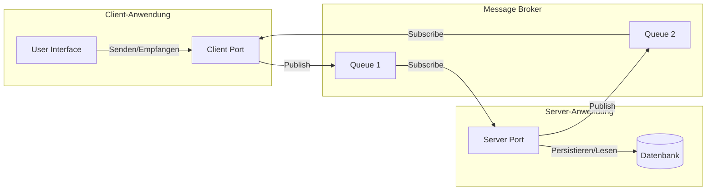

# Für die Entwicklung einer Chat-Applikation

Für die Entwicklung einer Chat-Applikation, die Einzel- und Gruppenchats unterstützt, mit Persistenz in einer Datenbank unter Verwendung einer Publish-Subscribe-Architektur und "Ports & Adaptors", empfehle ich folgenden Entwurf. Beachtet, dass dies eine vereinfachte Darstellung ist und Anpassungen je nach spezifischen Anforderungen und Rahmenbedingungen eurer Applikation erfordern kann.

## 1. Architekturübersicht

### Publish-Subscribe-Architektur
- **Message Broker (RabbitMQ)**: Dient als zentraler Kommunikationshub für Nachrichten.
- **Publisher**: Sendet Nachrichten (hier: Chat-Nachrichten) an den Broker.
- **Subscriber**: Empfängt Nachrichten vom Broker.

### Ports & Adaptors
- **Ports**: Schnittstellen für die Interaktion der Applikation mit externen Komponenten (wie RabbitMQ).
- **Adaptors**: Konkrete Implementierungen der Ports, z.B. für die Kommunikation mit RabbitMQ.

## 2. Nachrichtenformat

Für das Nachrichtenformat bietet sich ein JSON-Format an. Beispiel für eine Chat-Nachricht:

```json
{
  "type": "individual/group",
  "sender": "UserID",
  "content": "Nachrichtentext",
  "timestamp": "2023-12-06T15:00:00Z",
  "groupID": "GroupID (nur bei Gruppenchats)"
}
```

## 3. Mermaid-Diagramm (Markdown)

Hier ein vereinfachtes Mermaid-Diagramm zur Darstellung der Architektur:


## 4. Implementierung mit RabbitMQ und CloudAMQP

### Setup auf CloudAMQP
- **Cluster erstellen**: Registriere dich auf CloudAMQP und erstelle einen neuen RabbitMQ Cluster.
- **Zugangsdaten**: Notiere dir die Zugangsdaten für den Cluster.

### Beispielclient
- **Client Setup**: Verwende eine beliebige Programmiersprache, die RabbitMQ unterstützt, um einen Beispielclient zu erstellen.
- **Verbindung herstellen**: Verbinde den Client mit deinem CloudAMQP-Cluster.

### Erweiterungen
- **Anzeige verfügbarer User**: Implementiere eine Funktion, um aktive User anzuzeigen.
- **Erstellen von Gruppenchats**: Ermögliche das Erstellen von Gruppenchats und füge Logik hinzu, um Nachrichten an alle Mitglieder einer Gruppe zu senden.

### Abschliessende Hinweise
- Dieses Projekt erfordert Kenntnisse in der Softwareentwicklung, Netzwerkkommunikation und möglicherweise in der Frontend-Entwicklung.
